# Feature Matching (Only Traditional Method)
## Applied Feature Extraction and Descriptor Method to robust matching !!
**[Goal] We can apply various extracton and descriptor method for matching in challenging environment** 

**[Advanced] Algorithm extended by applying the corresponding github page  &rarr; [Parallax](https://github.com/SungJaeShin/Parallax.git)**

**[Advantage] We can easily apply various method only changing parameters!!**

- Challenging Environment 
   <table>
      <tr>
         <td> Query Image</td>
         <td> Candidate Image </td>
      </tr> 
      <tr>
         <td>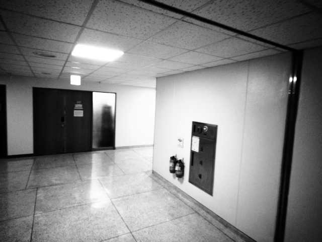 </td>
         <td>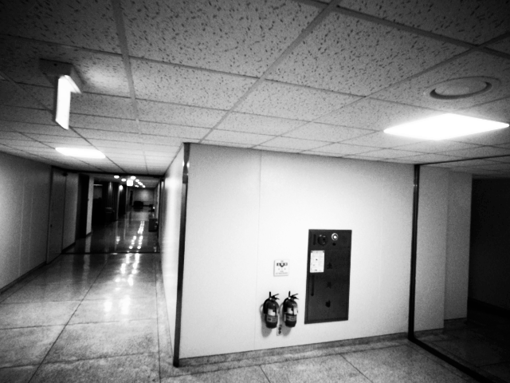 </td>
      </tr>
   </table>

## 1. Dependencies
   - OpenCV 3.2.0, OpenCV Contrib 3.2.0, C++ 11 version 
   
## 2. Methodology to apply feature matching
   - Feature Extraction Method
      - [1] ORB 
      - [2] goodFeaturesToTrack 
      - [3] SIFT
      
   - Feature Descriptor Method
      - [1] AKAZE
      - [2] SURF 
      - [3] DAISY

   - Macher Method 
      - [1] Brute-Force Matcher (BF)
      - [2] Fast Library for Approximate Nearest Neighbors Matcher (FLANN)
      
   - Matching Method
      - [1] vanilla match (VANILLA)
      - [2] knn match (KNN)
      - [3] radius match (RADIUS)
  
   - Outlier Rejection Method
      - [1] findFundamentalMatrix (FM)
      - [2] vector field consensus ([VFC](https://github.com/mpkuse/robust_feature_matching))

## 3. Build and Run 
Clone the repository and build and run simultaneously:
```
   $ cd ${workspace}
   $ git clone https://github.com/SungJaeShin/Feature_matching.git
   $ cd Feature_matching
   $ sh start.sh
```

## 4. Changing Parameters
- **IMAGE_NUM** (include.h): Put value to test image pair  

- **EXTRACT_MODE** (include.h):
   - 1 &rarr; apply ORB
   - 2 &rarr; apply GFTT (GoodFeaturesToTrack)
   - 3 &rarr; apply SIFT
   - 4 &rarr; apply GFTT(Query) + ORB(Candidate) 
   - 5 &rarr; apply GFTT(Query) + SIFT(Candidate)

- **DESCRIPTOR_MODE** (include.h): 
   - 1 &rarr; apply AKAZE
   - 2 &rarr; apply SURF
   - 3 &rarr; apply DAISY

- **MATCHER_MODE** (include.h):
   - 1 &rarr; apply BF Matcher (Brute-Force)
   - 2 &rarr; apply FLANN Matcher (Fast Library for Approximate Nearest Neighbors)

- **MATCHING_MODE** (include.h):
   - 1 &rarr; apply vanilla match
   - 2 &rarr; apply knn match
   - 3 &rarr; apply radius match
   
- **REJECTION_MODE** (include.h):
   - 1 &rarr; apply fundamentalMatrix 
   - 2 &rarr; apply VFC 

- **MIN_DIS** (include.h): Put value to change feature's Euclidean distance when using GoodFeaturesToTrack extractor

- **query_path, cand_path** (matching.cpp): Put absolute path for getting query image and candidate image

- **save_path** (plot.h): Put absolute path for saving matching result 

## 5. Advanced Changing Parameters (Option)
This variables are not requirement, but the following variables are also considered to obtain more robust results.
- [CASE 1] When you use **BFMatcher**, please change in create arguments
   - SIFT, SURF &rarr; cv::NORM_L1 & cv::NORM_L2  
   - ORB &rarr; cv::NORM_HAMMING

- [CASE 2] When you use **radiusMatch**, please change maxDistance argument
   - In above case, there are some preference radius results !! (Default = 0.3)
      - [Preference radius] 0.4 => 405 matches / 0.3 => 183 matches / 0.2 => 117 matches

- [CASE 3] When you use **findFundamentalMat**, please change ransacReprojThreshold argument (Default = 1)
   - If you want to get more robust result, then change **'0.1'** or etc. 

## 6. Results 
- Results of Inlier Number and Time Consumption
   - ORB Result
      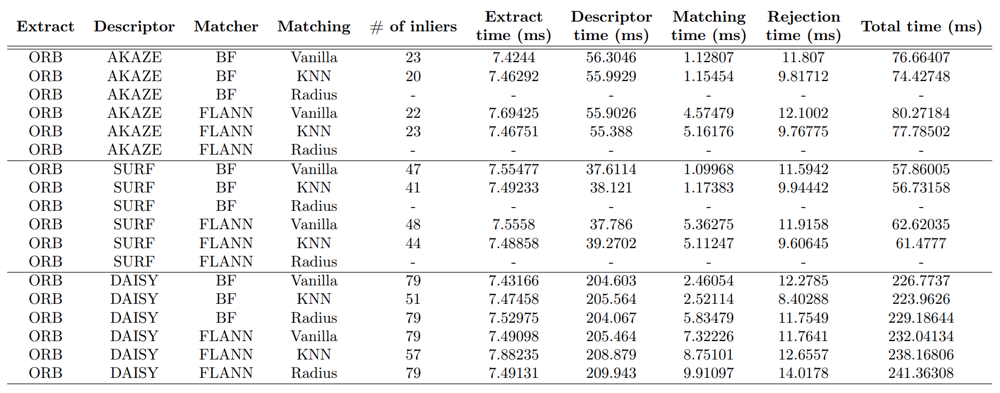
   
   - GFTT Result
      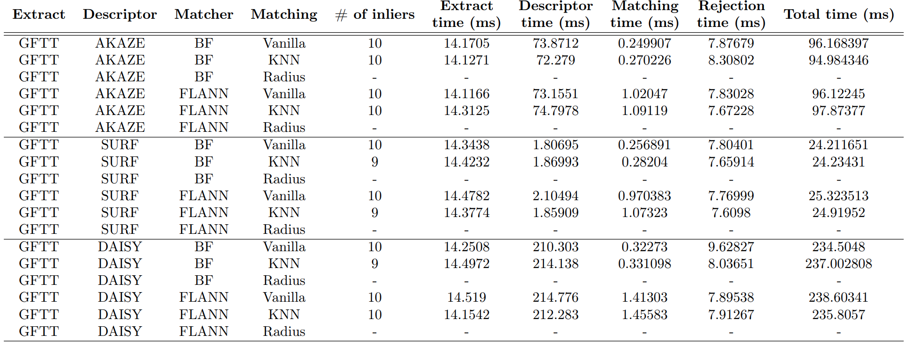
   
   - SIFT Result
      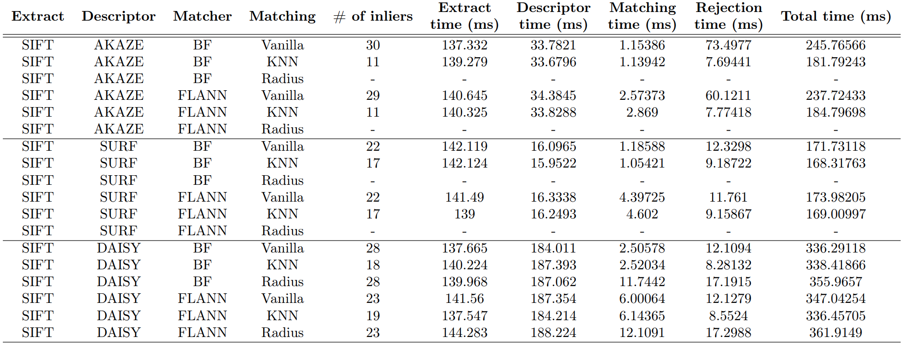

- Matching Results Set
   <table>
      <tr>
         <td> ORB + AKAZE + FM (inliers 22)</td>
         <td> ORB + SURF + FM (inliers 44)</td>
         <td> ORB + DAISY + FM (inliers 57)</td>
      </tr> 
      <tr>
         <td>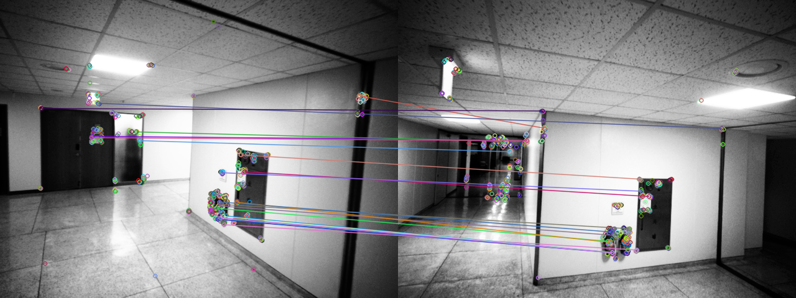 </td>
         <td>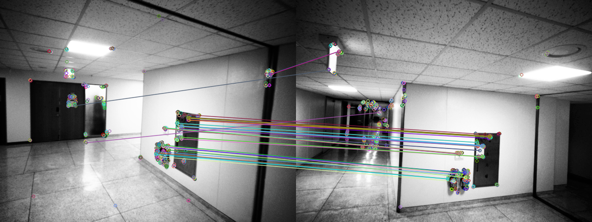 </td>
         <td>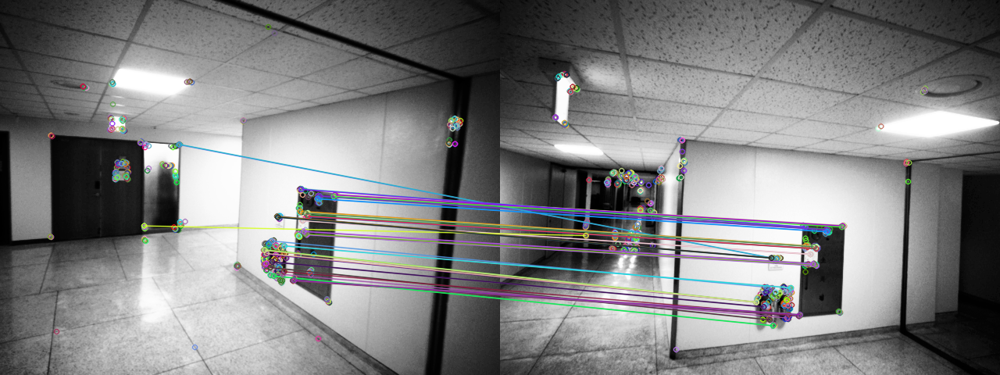 </td>
      </tr>
      <tr>
         <td> GFTT + AKAZE + FM (inliers 10)</td>
         <td> GFTT + SURF + FM (inliers 9)</td>
         <td> GFTT + DAISY + FM (inliers 10)</td>
      </tr> 
      <tr>
         <td> </td>
         <td>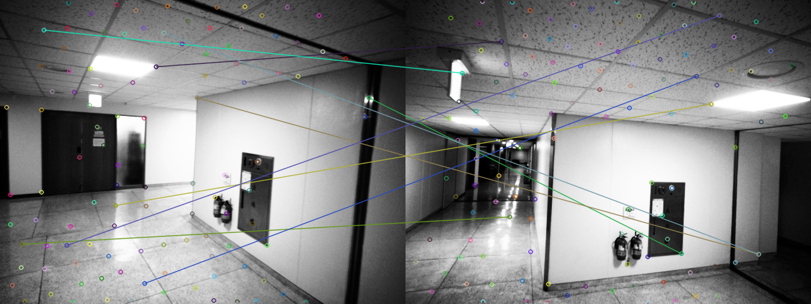 </td>
         <td> </td>
      </tr>
      <tr>
         <td> SIFT + AKAZE + FM (inliers 11)</td>
         <td> SIFT + SURF + FM (inliers 17)</td>
         <td> SIFT + DAISY + FM (inliers 19)</td>
      </tr> 
      <tr>
         <td>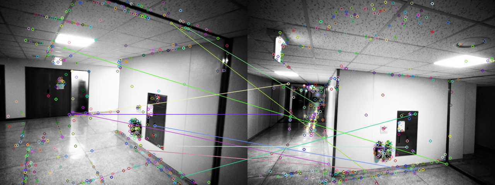 </td>
         <td> </td>
         <td>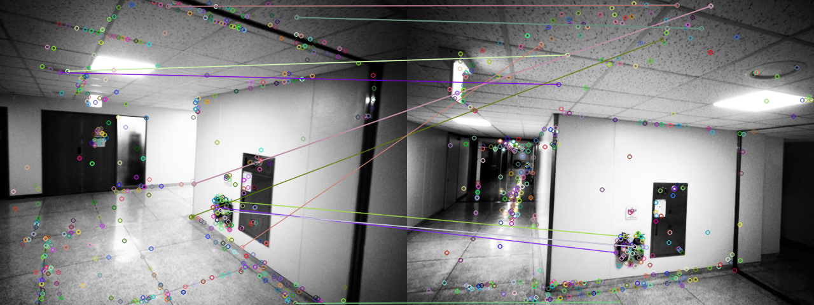 </td>
      </tr>
      <tr>
         <td> GFTT + ORB + AKAZE + FM (inliers 10)</td>
         <td> GFTT + ORB + SURF + FM (inliers 10)</td>
         <td> GFTT + ORB + DAISY + FM (inliers 8)</td>
      </tr> 
      <tr>
         <td>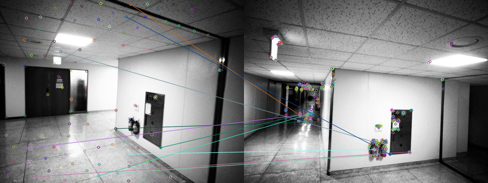 </td>
         <td>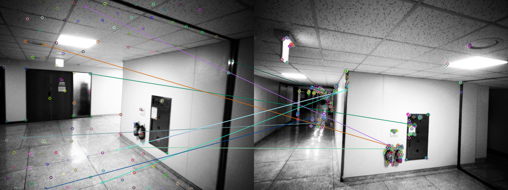 </td>
         <td>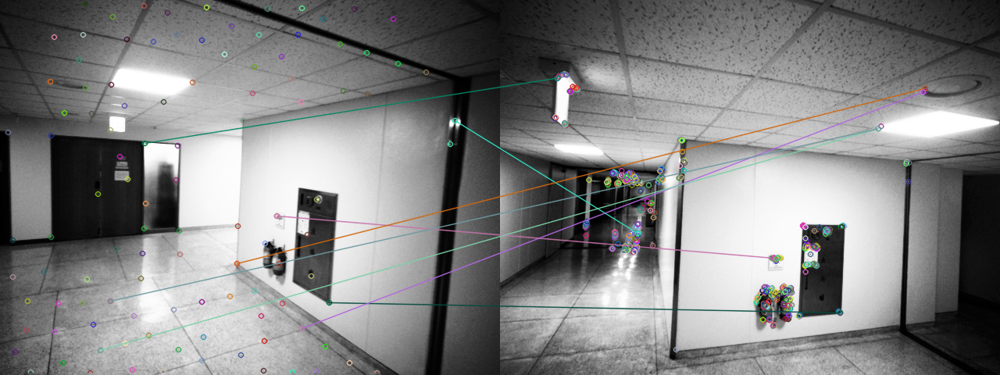 </td>
      </tr>
      <tr>
         <td> GFTT + SIFT + AKAZE + FM (inliers 10)</td>
         <td> GFTT + SIFT + SURF + FM (inliers 9)</td>
         <td> GFTT + SIFT + DAISY + FM (inliers 9)</td>
      </tr> 
      <tr>
         <td>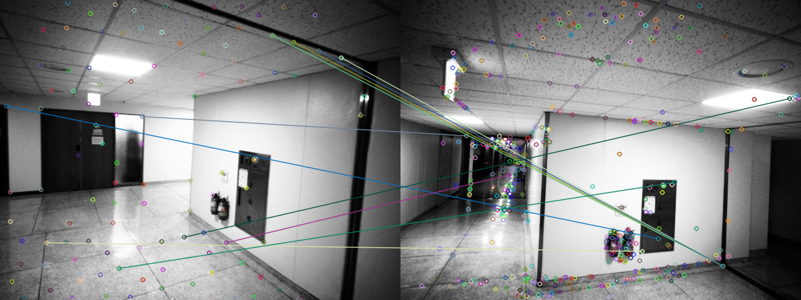 </td>
         <td>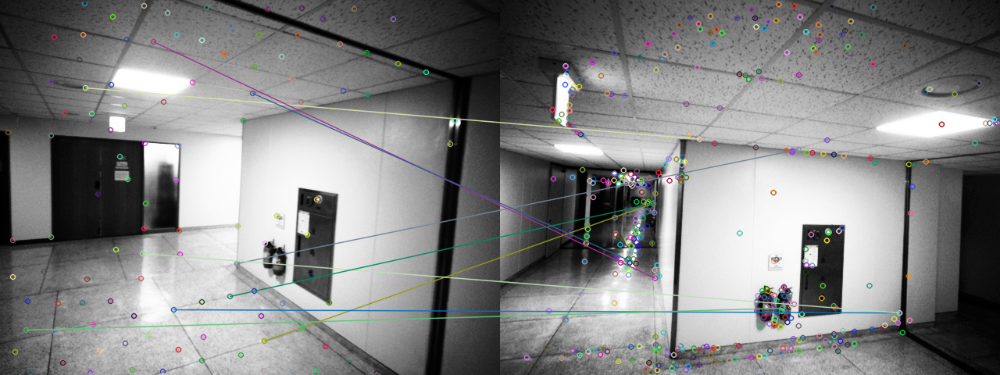 </td>
         <td>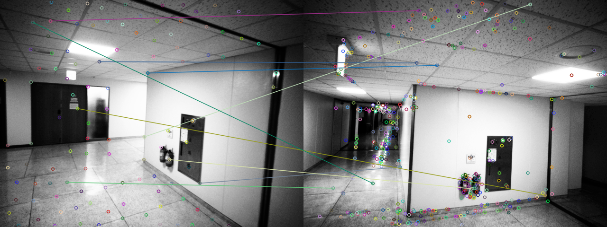 </td>
      </tr>
   </table>

## 7. Best Results
- C++ Results 
   - ORB + SURF + BF + KNN + FM (ransacReprojThreshold = 1)  
      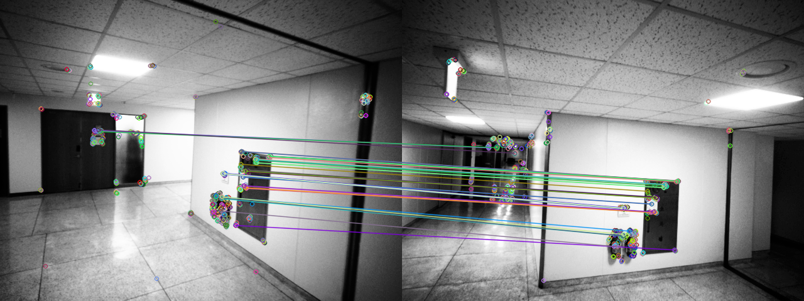
      
   - ORB + DAISY + BF + KNN + FM (ransacReprojThreshold = 1)  
      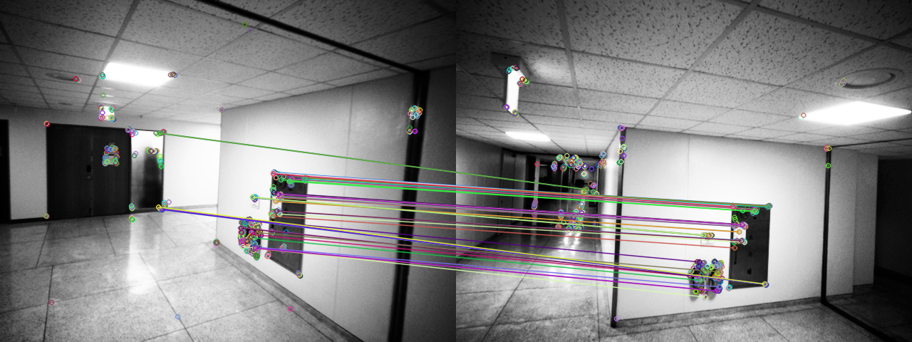

   - ORB + SURF + BF + KNN + FM (ransacReprojThreshold = 0.1)  
      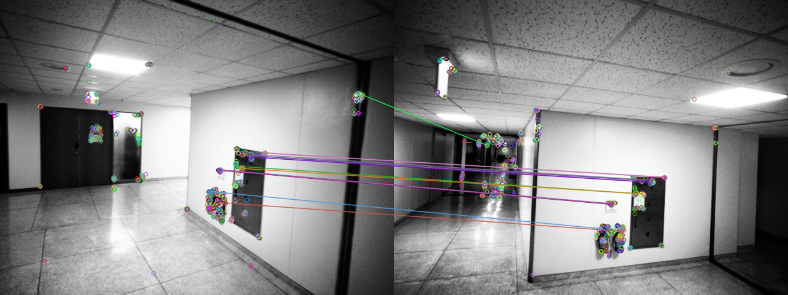
      
   - ORB + DAISY + BF + KNN + FM (ransacReprojThreshold = 0.1)  
      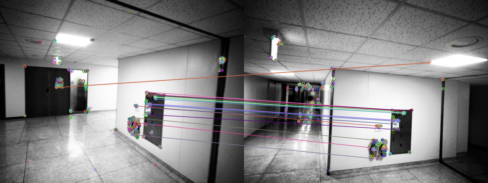
      
   - ORB + SURF + BF + KNN + VFC 
      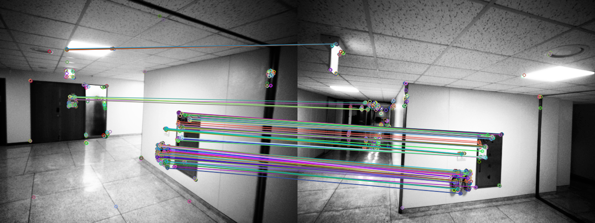

   - ORB + DAISY + BF + KNN + VFC 
      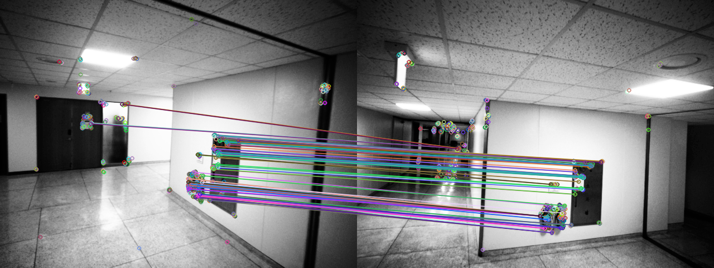

## 8. Support Docker
Test on Ubuntu 18.04 equipped with P2000 NoteBook 
   - [0] Download Basic Envrionment 
      - ([Download](https://hub.docker.com/r/pootti524/feature_matching)) opecn 3.2.0 w/ contrib, CUDA 9.0, cuDNN 7, ubuntu 16.04 
   - [1] Install Docker
      - Ref Site: https://docs.docker.com/engine/install/ubuntu/
   - [2] Get Appropriate Docker Images
      - Ref Site: https://hub.docker.com/
   - [3] Other Docker properties to communicate host machine
      - Ref Site: https://github.com/deepshwang/howtodocker
   - [4] Error Related
      - (1) docker: Error response from daemon: could not select device driver "" with capabilities: [[gpu]].
         - Ref Site: https://bluecolorsky.tistory.com/110
      - (2) nvidia-container-cli: initialization error: load library failed: libnvidia-ml.so.1
         - Ref Site: https://my-grope-log.tistory.com/20

## 9. Reference
[1] Jianbo Shi and Carlo Tomasi. Good features to track. In Computer Vision and Pattern Recognition, 1994. Proceedings CVPR'94., 1994 IEEE Computer Society Conference on, pages 593–600. IEEE, 1994. \
[2] David G. Lowe. Distinctive image features from scale-invariant keypoints. Int. J. Comput. Vision, 60(2):91–110, November 2004. \
[3] Herbert Bay, Tinne Tuytelaars, and Luc Van Gool. Surf: Speeded up robust features. Computer Vision–ECCV 2006, pages 404–417, 2006. \
[4] Ethan Rublee, Vincent Rabaud, Kurt Konolige, Gary R. Bradski: ORB: An efficient alternative to SIFT or SURF. ICCV 2011: 2564-2571. \
[5] Pablo Fernández Alcantarilla, Jesús Nuevo, and Adrien Bartoli. Fast explicit diffusion for accelerated features in nonlinear scale spaces. BMVC, pages 13.1–13.11, 2013.\
[6] E. Tola, V. Lepetit, and P. Fua. Daisy: An efficient dense descriptor applied to wide baseline stereo. IEEE Transactions on Pattern Analysis and Machine Intelligence, 32(5):815–830, May 2010. \
[7] Jiayi Ma, Ji Zhao, Jinwen Tian, Alan Yuille, and Zhuowen Tu. Robust Point Matching via Vector Field Consensus, IEEE Transactions on Image Processing, 23(4), pp. 1706-1721, 2014 \
[8] Jiayi Ma, Ji Zhao, Jinwen Tian, Xiang Bai, and Zhuowen Tu. Regularized Vector Field Learning with Sparse Approximation for Mismatch Removal, Pattern Recognition, 46(12), pp. 3519-3532, 2013 \
[9] DeTone, Daniel & Malisiewicz, Tomasz & Rabinovich, Andrew. SuperPoint: Self-Supervised Interest Point Detection and Description. CVPR Deep Learning for Visual SLAM Workshop (CVPR), 2018 \
[10] https://bkshin.tistory.com/entry/OpenCV-28-%ED%8A%B9%EC%A7%95-%EB%A7%A4%EC%B9%ADFeature-Matching \
[11] https://stackoverflow.com/questions/18744051/what-the-hessian-minimum-threshold-means-on-the-surffeaturedetector-function \
[12] https://www.researchgate.net/figure/Relation-between-hessian-threshold-value-and-Accuracy-of-SURF-detector-As-shown-in_fig2_309363445 \
[13] https://docs.opencv.org/3.4/d9/d37/classcv_1_1xfeatures2d_1_1DAISY.html \
[14] https://m.blog.naver.com/PostView.naver?isHttpsRedirect=true&blogId=pckbj123&logNo=100203116086 \
[15] https://076923.github.io/posts/Python-opencv-38/ \
[16] https://docs.opencv.org/3.4/db/d95/classcv_1_1ORB.html#adc371099dc902a9674bd98936e79739c \
[17] https://bkshin.tistory.com/entry/OpenCV-27-%ED%8A%B9%EC%A7%95-%EB%94%94%EC%8A%A4%ED%81%AC%EB%A6%BD%ED%84%B0-%EA%B2%80%EC%B6%9C%EA%B8%B0-SIFT-SURF-ORB \
[18] https://docs.opencv.org/3.4/d7/d60/classcv_1_1SIFT.html \
[19] https://leechamin.tistory.com/330 \
[20] https://github.com/mpkuse/robust_feature_matching \


## 11. Acknowledgement
Thanks for Yeeun Kim help to get robust feature matching method !! 

## 12. Future Works
   - Apply GCBB (Linear time vehicle relocation in SLAM paper)
