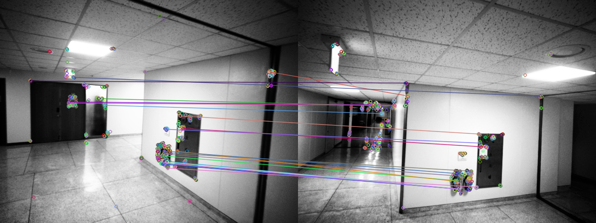
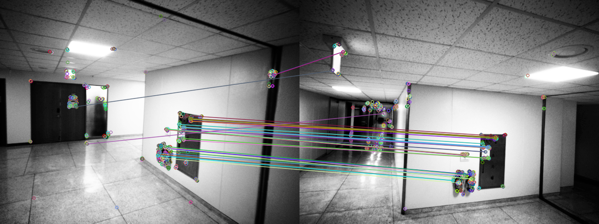
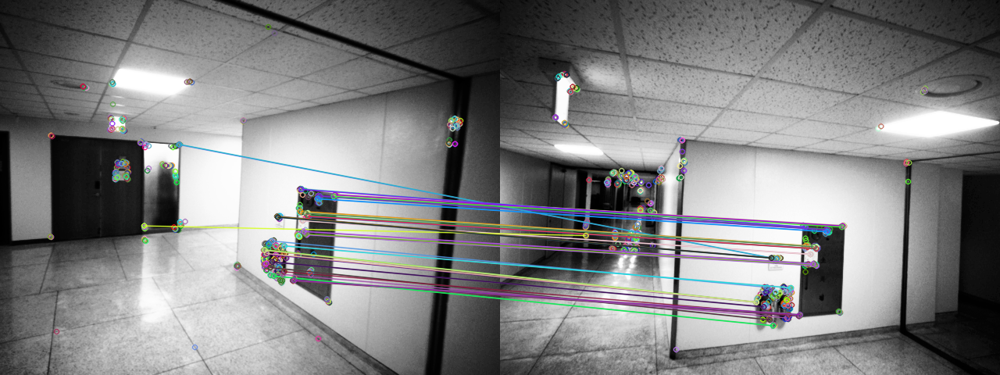

# Feature Matching
## Applied Feature Extraction and Descriptor Method to robust matching !!
**[Goal] We can apply various extracton and descriptor method for matching in challenging environment**
- Challenging Environment 
   <table>
      <tr>
         <td> Query Image</td>
         <td> Candidate Image </td>
      </tr> 
      <tr>
         <td> </td>
         <td> </td>
      </tr>
   </table>

## 1. Dependencies
   - OpenCV 3.2.0, OpenCV Contrib 3.2.0

## 2. Methodology to apply feature matching
   - Feature Extraction Method
      - [1] ORB 
      - [2] goodFeaturesToTrack 
      - [3] SIFT
      
   - Feature Descriptor Method
      - [1] AKAZE
      - [2] SURF 
      - [3] DAISY

   - Outlier Rejection Method
      - [1] findFundamentalMatrix (FM)

## 3. Build and Run 
Clone the repository and build and run simultaneously:
```
   cd ${workspace}
   git clone https://github.com/SungJaeShin/Feature_matching.git
   cd Feature_matching
   sh start.sh
```

## 4. Changing Parameters
- **IMAGE_NUM** (include.h): Put value to test image pair  
- **EXTRACT_MODE** (include.h):
   - 1 &rarr; apply ORB
   - 2 &rarr; apply GFTT (GoodFeaturesToTrack)
   - 3 &rarr; apply SIFT
   - 4 &rarr; apply GFTT(Query) + ORB(Candidate) 
   - 5 &rarr; apply GFTT(Query) + SIFT(Candidate)
- **DESCRIPTOR_MODE** (include.h): 
   - 1 &rarr; apply AKAZE
   - 2 &rarr; apply SURF
   - 3 &rarr; apply DAISY
- **MIN_DIS** (include.h): Put value to change feature's Euclidean distance when using GoodFeaturesToTrack extractor
- **query_path, cand_path** (matching.cpp): Put absolute path for getting query image and candidate image
- **save_path** (include.h): Put absolute path for saving matching result 

## 5. Results 
   <table>
      <tr>
         <td> ORB + AKAZE + FM </td>
         <td> ORB + SURF + FM </td>
         <td> ORB + DAISY + FM </td>
      </tr> 
      <tr>
         <td> </td>
         <td> </td>
         <td> </td>
      </tr>
   </table>

